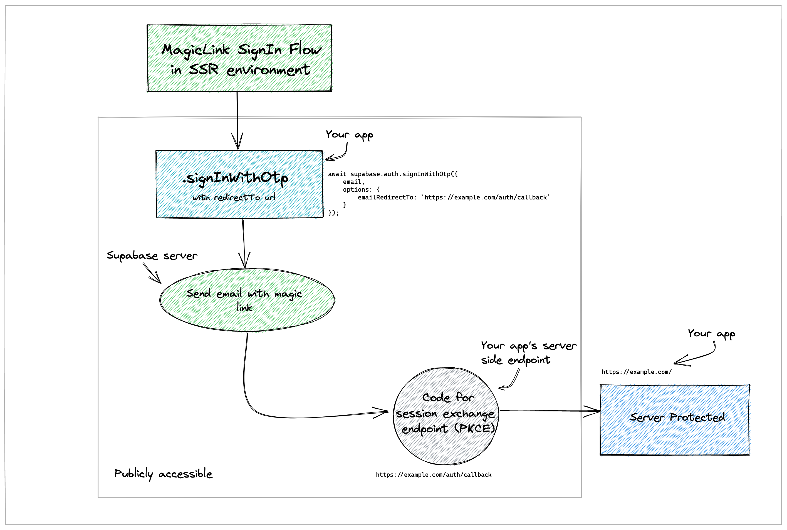

# Magic Link flow

These are Supabase projects showing how to do magic link login.

These projects make use of:

- [Supabase Auth Helpers](https://supabase.com/docs/guides/auth/auth-helpers)
- [Zod](https://zod.dev/) Schema Validation library
- [DaisyUI](https://daisyui.com/)
- [tailwindcss](https://tailwindcss.com/)
- [Playwright](https://playwright.dev/) e2e testing

## Reset Password Flow in Server-side rendering (SSR) environment

