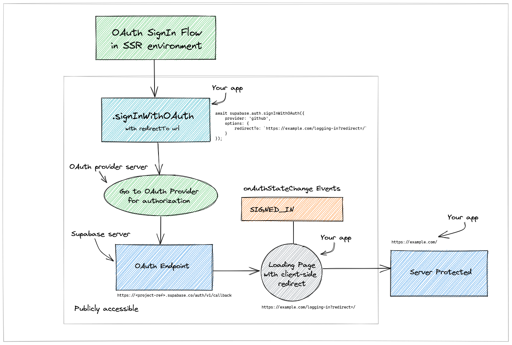

# OAuth Sign-in flow

These are Supabase projects showing how to do OAuth sign-in.

These projects make use of:

- [Supabase Auth Helpers](https://supabase.com/docs/guides/auth/auth-helpers)
- [Zod](https://zod.dev/) Schema Validation library
- [DaisyUI](https://daisyui.com/)
- [tailwindcss](https://tailwindcss.com/)

## OAuth SignIn Flow in Server-side rendering (SSR) environment

